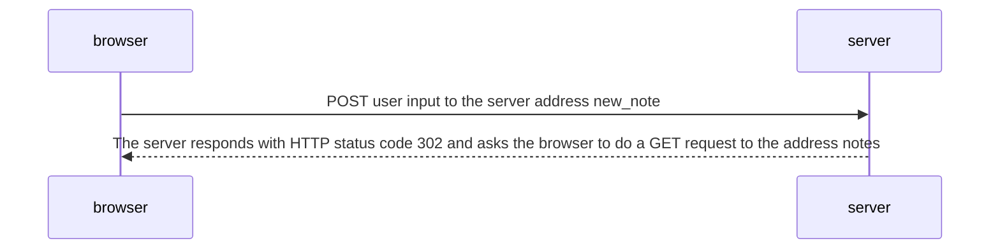

```mermaid
sequenceDiagram
 participant browser
 participant server
 browser->>server: POST user input to the server address new_note
 server-->>browser: The server responds with HTTP status code 302 and asks the browser to do a GET request to the address notes
```
