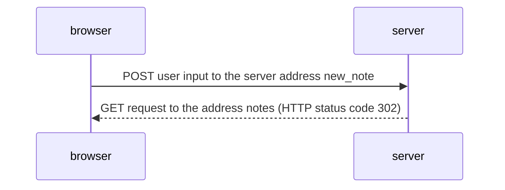

```mermaid
sequenceDiagram
 participant browser
 participant server
 browser->>server: POST user input to the server address new_note
 server-->>browser: GET request to the address notes (HTTP status code 302)
```
