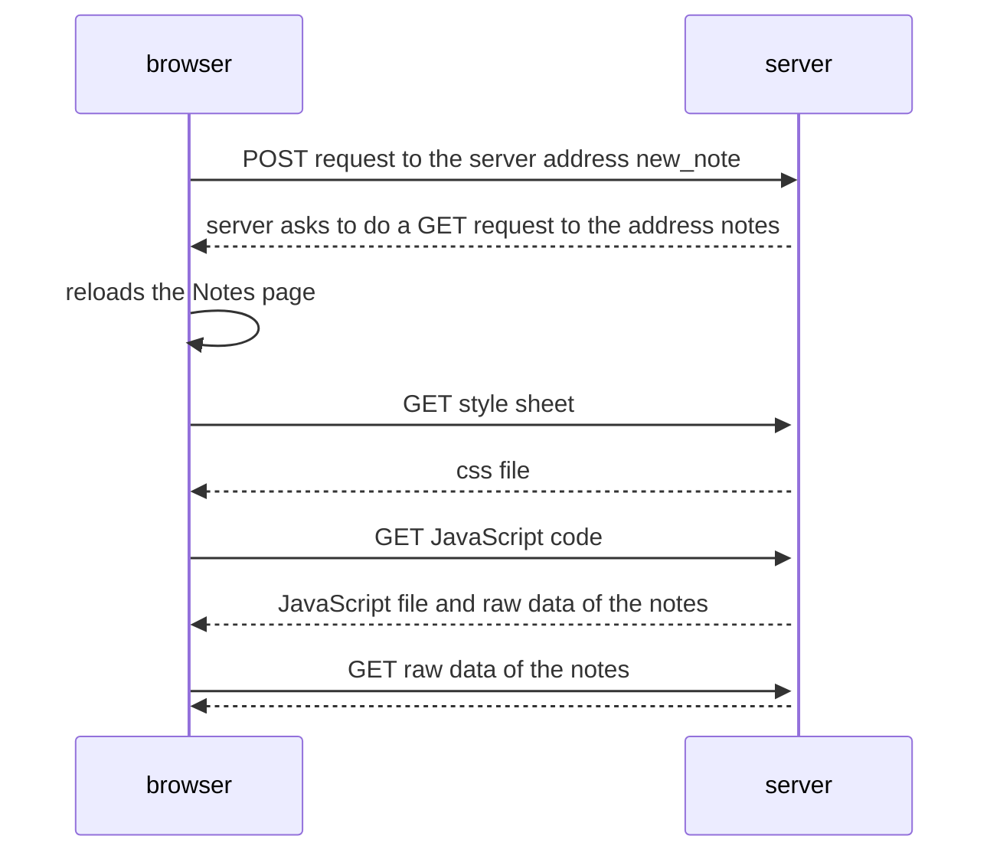

```mermaid
sequenceDiagram
 participant browser
 participant server
 browser->>server: POST request to the server address new_note
 activate server
 server-->>browser:  server asks to do a GET request to the address notes
 browser->>browser: reloads the Notes page
 browser->>server: GET style sheet
 server-->>browser: css file
 browser->>server: GET JavaScript code
 server-->>browser: JavaScript file and raw data of the notes
 browser->>server: GET raw data of the notes
 server-->>browser: 
```
