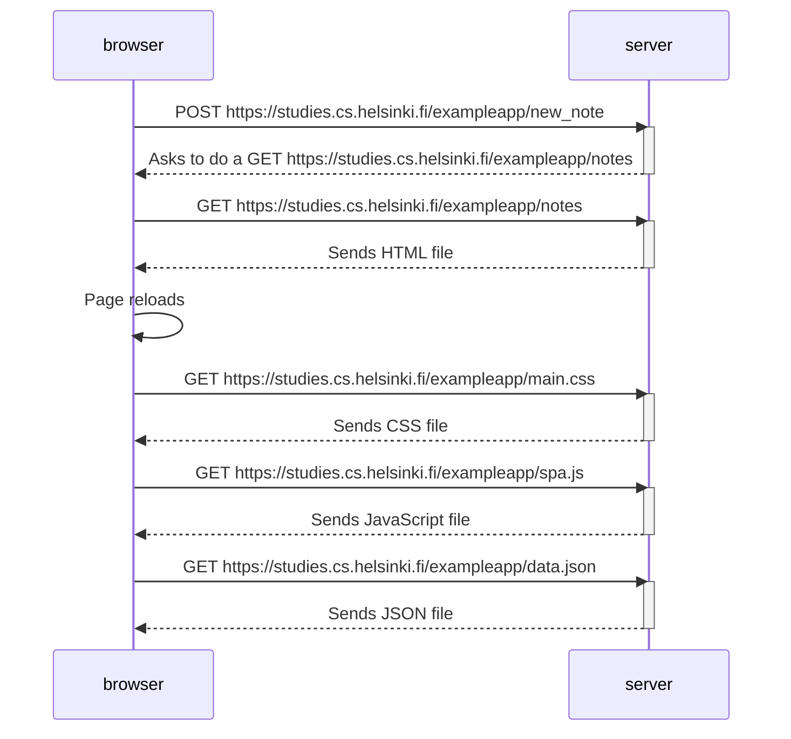

```mermaid
sequenceDiagram
 participant browser
 participant server
 browser->>server: POST https://studies.cs.helsinki.fi/exampleapp/new_note
 activate server
 server-->>browser:  Asks to do a GET https://studies.cs.helsinki.fi/exampleapp/notes
 deactivate server
 browser->>server: GET https://studies.cs.helsinki.fi/exampleapp/notes
 activate server
 server-->>browser: Sends HTML file
 deactivate server
 browser->>browser: Page reloads
 browser->>server: GET https://studies.cs.helsinki.fi/exampleapp/main.css
 activate server
 server-->>browser: Sends CSS file
 deactivate server
 browser->>server: GET https://studies.cs.helsinki.fi/exampleapp/spa.js
 activate server
 server-->>browser: Sends JavaScript file
 deactivate server
 browser->>server: GET https://studies.cs.helsinki.fi/exampleapp/data.json
 activate server
 server-->>browser: Sends JSON file
 deactivate server
```
