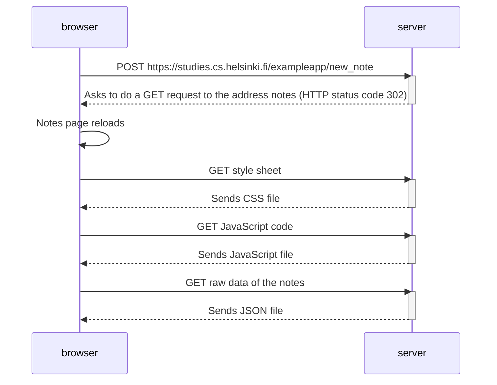

```mermaid
sequenceDiagram
 participant browser
 participant server
 browser->>server: POST https://studies.cs.helsinki.fi/exampleapp/new_note
 activate server
 server-->>browser:  Asks to do a GET request to the address notes (HTTP status code 302)
 deactivate server
 browser->>browser: Notes page reloads
 browser->>server: GET style sheet
 activate server
 server-->>browser: Sends CSS file
 deactivate server
 browser->>server: GET JavaScript code
 activate server
 server-->>browser: Sends JavaScript file
 deactivate server
 browser->>server: GET raw data of the notes
 activate server
 server-->>browser: Sends JSON file
 deactivate server
```
