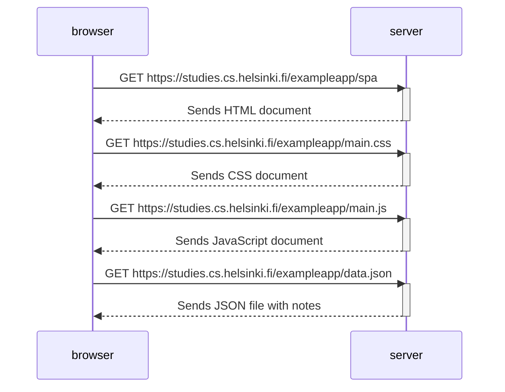

```mermaid
sequenceDiagram
 participant browser
 participant server
 browser->>server: GET https://studies.cs.helsinki.fi/exampleapp/spa
 activate server
 server-->>browser: Sends HTML document
 deactivate server
 browser->>server: GET https://studies.cs.helsinki.fi/exampleapp/main.css
 activate server
 server-->>browser: Sends CSS document
 deactivate server
 browser->>server: GET https://studies.cs.helsinki.fi/exampleapp/main.js
 activate server
 server-->>browser: Sends JavaScript document
 deactivate server
 browser->>server: GET https://studies.cs.helsinki.fi/exampleapp/data.json
 activate server
 server-->>browser: Sends JSON file with notes
 deactivate server
```
