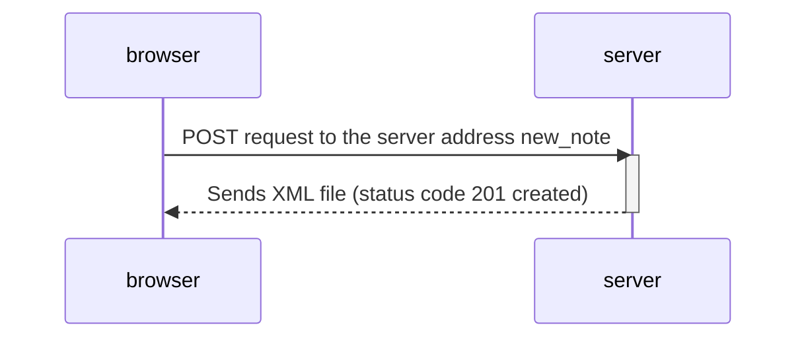

```mermaid
sequenceDiagram
 participant browser
 participant server
 browser->>server: POST request to the server address new_note
 activate server
 server-->>browser: Sends XML file (status code 201 created)
 deactivate server

```
